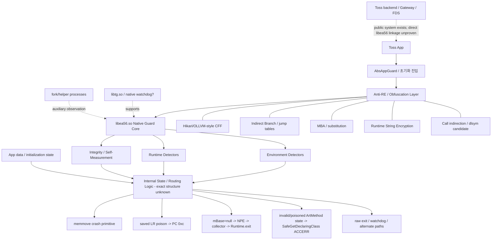

# Toss Guard / `libea56.so` Reverse-Engineering Handoff Report

> **작성일:** 2026-09-22 (KST)  
> **목적:** 다른 LLM/분석가가 현재까지의 토스 모바일 가드 분석을 반복하지 않고 바로 이어갈 수 있도록, 실측 결과·정적 분석·Hikari/OLLVM 계보 추론·공개자료·논문·도구·다음 실험을 하나의 문서로 통합한다.  
> **분석 대상:** Android 앱 `viva.republica.toss`, 주요 네이티브 가드 `libea56.so`, 보조 컴포넌트 `libtg.so`  
> **중요:** 이 문서는 **관측 사실(Observed)**, **강한 추론(Strong inference)**, **작업 가설(Hypothesis)**을 의도적으로 구분한다. 토스가 Hikari를 사용한다고 공개한 자료는 없으며, Hikari 계보는 바이너리 fingerprint 기반 provenance 추론이다.

---

## 0. 이 문서를 읽는 방법

### Evidence labels

- **[OBSERVED]**: 실제 바이너리/실행 trace/tombstone/ftrace/uprobes/ELF metadata 등에서 직접 확인.
- **[STRONG]**: 여러 독립 관측이 일치하지만 원인 store/caller 등 마지막 연결 고리가 남아 있음.
- **[HYP]**: 현재 설명력이 높은 작업 가설. 추가 실험으로 반증 가능.
- **[CORRECTED]**: 과거에는 유력했지만 이후 실측으로 수정/폐기된 해석.
- **[PUBLIC]**: 토스/프로젝트/논문 등 공개자료가 직접 말하는 내용.

### 한 문장 mental model

현재까지의 가장 보수적인 모델은 다음이다.

> **`libea56`는 다수의 환경·런타임·무결성 detector를 병렬/반복적으로 수행하고, 내부 상태/라우팅 로직을 거쳐 여러 서로 다른 종료·크래시 actuator 중 하나를 선택한다. Hikari/OLLVM 계열로 보이는 Anti-RE 계층은 detector와 actuator 사이의 인과관계를 정적으로 추적하기 어렵게 만든다.**

쉽게 말하면:

> 탐지를 단순히 숨기는 것보다 **“무엇에 걸려서 왜 죽었는지”를 연결하기 어렵게 만든 구조**에 가깝다.

---

# 1. Source artifacts / 재현 대상

## 1.1 주요 로컬 파일

현재 작업공간에서 핵심 파일:

```text
/mnt/data/toss_lineage/libea56.so
/mnt/data/toss_lineage/libtg.so
/mnt/data/toss_lineage/full.dis
/mnt/data/toss_lineage/relocs.txt
/mnt/data/toss_lineage/FINDINGS.md
/mnt/data/toss_exp_extract/FINDINGS.md
/mnt/data/toss_sessions/session20..27/*
/mnt/data/toss_unidbg/libea56.so
/mnt/data/toss_unidbg/libea56.dis
/mnt/data/toss_unidbg/FINDINGS.md
```

### SHA-256

```text
libea56.so
c454eb404cf30a85c55e8182099230ad434285b6688e055bc75b5769f6203b89

libtg.so
836b2323e02b5caa6a34eaa867cbf7c27170634a05168cf889e65ab2b8e22767
```

## 1.2 ELF provenance

### `libea56.so`

[OBSERVED]

- ELF64, little-endian, AArch64, `ET_DYN`.
- `.note.android.ident`:
  - API: 21
  - NDK: `r21b`
  - build: `6352462`
- GNU Build ID: `bb57fae51670dcff`

공식 AOSP에서도 **Android NDK r21b = build 6352462**로 확인된다.

Reference:
- Android NDK r21b tag: https://android.googlesource.com/platform/prebuilts/clang/host/windows-x86/+/refs/tags/ndk-r21b
- NDK r21b tree: https://android.googlesource.com/platform/ndk.git/+/refs/tags/ndk-r21b

**주의:** `.note.android.ident`는 최종 Android link/sysroot provenance에 매우 강한 증거지만, 모든 object가 반드시 해당 NDK의 특정 Clang revision으로 컴파일됐다는 뜻까지는 아니다. `r21b` tree에는 `clang-r365631c` 계열 prebuilt가 존재하지만, 이 보고서에서는 exact compiler version을 확정하지 않는다.

### `libtg.so`

[OBSERVED]

- `.note.android.ident`:
  - API: 21
  - NDK: `r18b`
  - build: `5063045`
- GNU Build ID: `e703d296c7aff53c241c0ab6956b3af25d6a7bf4`

Reference:
- Android NDK r18b build 5063045: https://android.googlesource.com/toolchain/gcc/+/ndk-r18b

[STRONG]

`libea56`와 `libtg`가 **서로 다른 NDK generation**을 사용한 흔적은 두 컴포넌트가 단일 동일 빌드 파이프라인에서 한 번에 생성된 것보다는, 서로 다른 시기/계보의 네이티브 보안 컴포넌트를 조합했을 가능성을 높인다. 단, 이것만으로 각 역할의 개발 조직/시기를 확정할 수는 없다.

---

# 2. 실험 환경과 분석 전략의 변화

## 2.1 기존 주력: LKM 기반 Android Emulator

분석 초기~중기에는 실제 Android 13 AVD에 원본 Toss 앱을 설치하고, LKM/프롭/호스트 GL 패치 등을 이용해 에뮬레이터 흔적을 줄이면서 **실제 앱·ART·Binder·procfs·thread·signal·GPU/display 상태를 유지한 Ground Truth 환경**을 만들었다.

이 방식이 확인한 것:

- property 전수 탐색
- `/proc/self/maps`, `smaps`, `status`, `fd`, `task/*/comm`, 타 프로세스 `cmdline`
- CPU/core/MIDR/uname/sysinfo
- GL vendor/renderer/version/extensions
- display resolution/density
- package/overlay 흔적
- 자기 라이브러리 디스크/메모리 정합성
- fork/helper/watchdog 동작
- signal/ART/Bugsnag/Java Runtime.exit 종료 체인
- 여러 actuator 변형

## 2.2 현재 추천: LKM AVD를 버리는 것이 아니라 역할 분리

현재 문제는 “무슨 환경 흔적을 보나?”에서 “`libea56` 내부에서 detector → state → actuator가 어떻게 연결되나?”로 이동했다.

따라서 권장 비중:

```text
LKM Android Emulator : Ground Truth / 최종 검증
unidbg              : 네이티브 함수 단위 결정론적 실행/trace
Ghidra/IDA           : CFG/xref/semantic recovery
```

권장 루프:

```text
Real Android/LKM
   ↓ 실제 실행상태·주소·입력 확보
unidbg
   ↓ concrete execution / branch / memory trace
Ghidra/IDA
   ↓ CFG/xref/decompiler 복원
Real Android/LKM
   ↓ 실제 환경에서 재검증
```

---

# 3. 현재 가장 보수적인 기술 아키텍처

## 3.1 Technical view



## 3.2 쉽게 설명

1. **센서가 많다.** 루팅/에뮬레이터 흔적 하나만 보는 것이 아니라 파일, 프로세스, CPU, GPU, display, 메모리 등 여러 계층을 본다.
2. **센서 결과와 종료가 1:1로 보이지 않는다.** 같은 계열의 의심 상태라도 실행 조건/앱 데이터/초기화 상태에 따라 다른 방식으로 끝날 수 있다.
3. **죽이는 방식도 여러 개다.** `memmove`, 저장 LR 오염, Java NPE, ART fault, exit 등 서로 다른 기술 계층을 사용한다.
4. **난독화는 “탐지기를 숨기는 것”보다 “원인→결과 연결을 흐리는 것”에 특히 효과적이다.**
5. **실제 Android를 관측하는 것만으로는 이제 비효율적이다.** 네이티브 함수 단위로 떼어 unidbg에서 반복 실행하고, 결과를 실제 AVD에서 검증하는 단계가 적절하다.

---

# 4. Detector Battery — 직접 관측된 탐지/측정 표면

## 4.1 Environment

[OBSERVED]

- `__system_property_foreach` 기반 property 전수/광범위 검사
- `ro.boot.qemu.*`, `vendor.qemu.*`, product/build fingerprint 계열
- emulator/goldfish/ranchu 관련 흔적
- CPU core count/topology
- `/proc/cpuinfo`
- `uname(2)` / `/proc/version` 정합
- `sysinfo()` / RAM 정보
- CPU MIDR 계열
- GL vendor/renderer/version/extensions
- display resolution/density
- emulator overlay/package 흔적
- SELinux 관련 경로/상태

## 4.2 Runtime / process observation

[OBSERVED]

- `/proc/self/status` / TracerPid
- `/proc/self/task/*/comm`
- `/proc/self/cmdline`
- 타 PID `/proc/N/cmdline` 등
- `/proc/self/fd/*` readlink
- process/thread enumeration
- maps/smaps
- fork/poll/helper behavior
- `dl_iterate_phdr`
- 동적 API resolution (`dlopen`, `dlsym`)

초기 사망 직전 관측 시퀀스에는 시스템 라이브러리 스캔, maps 반복, SELinux, status/TracerPid, NOX/BlueStacks marker, thread comm, cmdline, fd 수백 개 resolve, smaps, 자기 lib 정합성 검사가 포함됐다.

## 4.3 Integrity / self-measurement

[OBSERVED]

- 자기 라이브러리 디스크/메모리 정합성 확인 정황.
- `process_vm_readv`를 이용한 자기 프로세스 메모리 read가 반복 관측됨.
- 특정 런에서 `RxCachedThreadS` 계열이 **632회** `process_vm_readv`를 수행하는 것이 결정론적으로 관측됨.

### 현재 해석

- **Self-read 존재와 632회 반복은 [OBSERVED].**
- 사용자의 현재 working model에서는 이를 **self-measurement**로 취급한다.
- 다만 **“632개의 고정 integrity manifest entry”인지, 광범위 artifact scanner인지, 특정 VMA/구조체 검증인지**는 아직 미해결이다.
- `process_vm_readv` syscall 자체가 SIGSEGV를 발생시키는 것은 아니다. 이후 분석에서 syscall은 EFAULT 등을 반환할 수 있을 뿐, fault와의 인과관계는 별도로 분리됐다.

### 다음 결정 실험

각 호출을 다음 triplet으로 정규화한다.

```text
(target VMA/module, normalized offset, iov_len)
```

여러 clean launch에서 ASLR 정규화 후 집합 유사도를 비교한다.

- 작은 고정 size(8/16/32/64B)가 반복 → 구조체/pointer/prologue 측정 가능성↑
- page-sized 4096B 중심 → page integrity/hash 가능성↑
- 넓은 영역 순차 scan → artifact/signature scanner 가능성↑
- 여러 런에서 동일 module+offset set → manifest/measurement engine 가능성↑

---

# 5. Cross-layer consistency — “magic indicator 하나”보다 정합성 문제

[STRONG]

실험 중 하나의 emulator marker를 제거해도 계속 사망했고, 서로 다른 계층의 값을 맞출 때 행동/생존시간이 변했다.

예:

- CPU: core count / cpuinfo / sysfs / MIDR / uname
- GPU: GL vendor / renderer / version / extension / library name / fd
- process: maps / smaps / phdr / 실제 backing file
- device profile: build props / screen size / density / CPU/GPU identity

또 maps 위장에 다른 앱의 내용을 잘못 서비스했을 때 가드가 그 경로/라이브러리를 따라가 판정에 영향을 주는 현상이 관찰됐다.

따라서 현재는 다음 표현이 안전하다.

> **Cross-layer consistency checking이 강하게 의심된다.**

하지만 아래는 아직 확정하지 않는다.

> “중앙의 단일 Cross-Consistency Engine/ML graph가 존재한다.”

---

# 6. Multi-Actuator Enforcement — 종료/자폭 경로

## 6.1 `memmove` abnormal-length primitive

[OBSERVED]

초기/일부 부트에서는 `libea56` 상태값이 비정상적인 `memmove` length로 이어져 의도적 SEGV 형태의 자폭을 만들었다.

### `ctx+0x1c8` 관련 정정

한 세션에서는 `ctx+0x1c8`이 여러 체크 차이값을 합산하는 accumulator처럼 보였고 그 값이 `memmove` length와 연결됐다.

그러나 이후 부트의 사망은 **saved LR poison**으로 확인되어 해당 모델은 보편적인 전역 Risk Score 모델이 아니었다.

**[CORRECTED]**

- `ctx+0x1c8 == 전체 가드의 중앙 risk score`라고 가정하면 안 됨.
- 특정 detector chain/actuator variant의 local accumulator일 수 있음.

## 6.2 saved LR poison → `PC=0xc`

[OBSERVED, strong structural proof]

특정 사망 경로에서는 저장된 LR 슬롯만 표적 store로 덮였다.

관측:

```text
saved LR = 0xc
↓
공유 epilogue에서 ldp x29,x30
↓
ret
↓
PC = 0xc
↓
SIGSEGV
```

스택 카나리는 정상 통과했으므로 일반 stack-smash보다 **saved-LR 슬롯을 노린 의도적 store**와 잘 맞는다.

실행 trace상 poison 진입 이후 무조건 분기 chain이 존재하며, 실제 환경 판정은 그 상류 상태변수/dispatcher에서 이뤄지는 것으로 분석됐다.

## 6.3 `mBase=null` → NPE → crash collector → `Runtime.exit(0)`

[OBSERVED]

후기 세션에서 데이터가 존재하는 앱 상태에서는 다음 경로가 반복적으로 관측됨.

```text
ContextWrapper.isRestricted()
        ↓
this->mBase == null
        ↓
implicit null-check / far=0 SIGSEGV
        ↓
ART NullPointerHandler standard transformation
        ↓
NPE / crash collection (Bugsnag/handler chain)
        ↓
Java Runtime.exit(0)
```

중요한 정정:

- 한때 `ucontext crafted return`으로 해석했으나, 디스어셈블/pgoff 보정 후 ART의 **표준 NPE 변환**으로 정정됨.
- `Runtime.exit(0)`을 Frida에서 차단한 런에서는 원본 프로세스가 7분+ 포그라운드 생존한 관측이 있음. 따라서 일부 런에서는 Java exit이 마지막 종료 관문임이 확인됨.
- 다만 UI/기능 상태가 정상이라는 뜻은 아님. “프로세스 생존”과 “정상 앱 기능”을 분리할 것.

### Java dispatch bypass

[STRONG]

`ContextWrapper.isRestricted()` Java implementation hook가 성공적으로 장착됐는데도 fault 경로에서 hook HIT가 0이었다.

현재 해석:

> fault를 만드는 `isRestricted` 경로는 일반 Java method dispatch를 우회하며, native/AOT direct invocation 계열일 가능성이 높다.

정확한 native caller와 callsite를 더 직접적으로 잡으면 확정 수준으로 올릴 수 있다.

## 6.4 초기화 상태 → `SafeGetDeclaringClass` ART ACCERR

[OBSERVED + STRONG MODEL]

`pm clear` 직후 초기화 상태에서는 약 0.3~0.5초 내 즉사하는 별도 경로가 반복 관측됨.

핵심 trace:

```text
SafeGetDeclaringClass 근처 fault
si_addr ∈ libart.so PROT_NONE guard page
연속 SFI11 / handler internal fault
```

현재 source report의 모델:

```text
invalid / poisoned ArtMethod-like pointer
    ↓
ART FaultManager / SafeGetDeclaringClass validation
    ↓
libart PROT_NONE guard page access
    ↓
SEGV_ACCERR / double fault
    ↓
immediate death
```

**현재 종합 판단:**

- “가짜/오염 ArtMethod 상태가 ART 검증기를 죽이는 것”은 매우 강한 모델.
- 그러나 **정확히 가드의 어느 store가 그 pointer/state를 심는지**는 아직 직접 포착되지 않았다.
- 따라서 보고서에서는 “guard-injected fake ArtMethod* 확정”보다 “invalid/poisoned ArtMethod-like state, injection strongly suspected”가 더 보수적이다.

## 6.5 앱 데이터/초기화 상태와 actuator 선택

[OBSERVED correlation]

```text
pm clear / 데이터 없음
    → cmdline 위장 + ART SafeGetDeclaringClass 즉사

데이터 존재
    → mBase=null NPE → collector → Runtime.exit(0)
```

해석에서 주의:

- **“판정 score가 파일에 저장된다”는 것은 미확정.**
- 확정된 것은 **앱 data/init state와 처형 경로가 강하게 결합돼 있다는 것**.
- 가능한 설명: bootstrap state, installation state, guard cache, lifecycle state, persisted detector state 등.

---

# 7. Anti-observation / Anti-analysis 계층

## 7.1 cmdline / comm disguise

[OBSERVED]

토스 UID 프로세스가 다음과 같은 이름으로 보이는 사례가 반복됨.

```text
com.google.android.configupdater
logcat
which
pm
gateway.toss.im
...
```

후기 분석에서 일부 PID가 실제 다른 앱/자식이 아니라 **Toss UID의 cmdline/comm 위장**임을 재확인했다.

실무 영향:

- `pidof viva.republica.toss`만 믿으면 프로세스를 놓칠 수 있음.
- UID 기반 추적 필요.

## 7.2 raw syscall / libc bypass

[OBSERVED]

일부 종료/시그널 경로가 libc hook을 우회해 raw syscall을 사용하는 사례가 확인됨.

따라서 Frida에서 `kill`, `exit` 등의 libc symbol만 hook하는 것은 충분하지 않다.

## 7.3 Frida / instrumentation sensitivity

[OBSERVED]

- spawn injection이 경로를 바꾸거나 초기 ART fault를 유발하는 세션 존재.
- attach timing에 따라 Java hook이 가능한 상태도 존재.
- uprobe를 특정 위치에 부착했을 때 fault 위치/경로가 변한 사례가 있어 코드/실행무결성 민감성이 의심됨.

[STRONG]

단순한 `"frida"` 문자열 signature detection만으로 전체 현상을 설명하기 어렵다. instrumentation presence/code alteration에 민감한 경로가 존재할 가능성이 높다.

---

# 8. Hikari / OLLVM provenance analysis

## 8.1 결론

현재 가장 타당한 표현:

> **Hikari-derived Custom LLVM Protection Pipeline**

또는 더 보수적으로:

> **Hikari/OLLVM-style custom LLVM obfuscation pipeline**

**중요:** Toss가 Hikari를 사용한다고 공개적으로 확인한 자료는 없다. 아래는 바이너리 구조와 공개 Hikari 구현 간의 fingerprint 비교다.

## 8.2 Fingerprint A — 대량 `R_AARCH64_RELATIVE` → `.text`

[OBSERVED]

`libea56.so`:

```text
R_AARCH64_RELATIVE total          7,327
addend가 .text를 가리킴          7,314 (99.8%)
unique .text target               7,264
```

`.text` range:

```text
0x34000 .. 0x16f090
```

대표 예:

```asm
0xb0284  adrp x9, 0x181000
0xb0288  add  x9, x9, #0x350
0xb028c  ldr  x9, [x9,#0x330]
0xb0290  br   x9
```

relocation:

```text
0x181680 R_AARCH64_RELATIVE -> 0xb02b8
```

즉 data table의 code pointer를 읽어 `br`로 이동하는 실제 구조가 존재한다.

### Hikari와의 대응

Hikari 공개 `IndirectBranch.cpp`는 basic block address를 `BlockAddress`로 수집해 table을 만들고 direct branch를 register-based indirect branch로 바꾸는 구조다.

References:

- Hikari Core: https://github.com/HikariObfuscator/Core
- `IndirectBranch.cpp`: https://github.com/HikariObfuscator/Core/blob/master/IndirectBranch.cpp
- IndirectBranching wiki: https://github.com/HikariObfuscator/Hikari/wiki/IndirectBranching

[STRONG]

이 relocation 밀도 + 실제 `ldr → br` target table 패턴은 **Classic OLLVM flattening만으로는 설명력이 떨어지고 Hikari IndirectBranch 계열과 매우 잘 맞는다.**

## 8.3 Fingerprint B — atomic string-decryption-style guards

[OBSERVED]

전체 disassembly에서:

```text
LDAXR count = 277
STLXR count = 261
```

대표 패턴:

```asm
0x38718  adrp  x8, 0x186000
0x3871c  add   x8, x8, #0x318
0x38720  ldaxr w8, [x8]
0x38724  cbnz  w8, 0x38748
...
0x38738  stlxr w10, w8, [x9]
0x3873c  cbnz  w10, 0x38718
```

### Hikari와의 대응

Hikari StringEncryption 공개 설명:

- 함수가 사용하는 문자열을 수집/복사
- 복호 여부를 나타내는 global variable 생성
- 함수 진입부에 detection/decryption 삽입
- 상태 확인/기록을 **atomically** 수행

Reference:
- Hikari StringEncryption: https://github.com/HikariObfuscator/Hikari/wiki/StringEncryption

[STRONG]

`LDAXR/STLXR`가 많다는 사실 단독으로 Hikari를 증명하지는 않지만, **문자열 전량/대규모 암호화 관측 + function-entry style atomic status pattern**과 결합하면 Hikari StringEncryption 계보 가능성을 크게 높인다.

## 8.4 Fingerprint C — CFF / MBA / substitution

[OBSERVED/STRONG]

- dispatcher/state-machine 형태의 제어흐름
- indirect `br/blr`
- 단순 연산을 복잡한 boolean arithmetic으로 바꾼 식
- 예: `(a XOR b) + 2*(a AND b) = a+b` 계열
- state variable이 여러 block에 확산돼 상류 detector와 actuator 사이 연결을 정적으로 따라가기 어려움

References:
- OLLVM Control Flow Flattening: https://github.com/obfuscator-llvm/obfuscator/wiki/Control%20Flow%20Flattening
- OLLVM Bogus Control Flow: https://github.com/obfuscator-llvm/obfuscator/wiki/Bogus-control-flow
- OLLVM install/flags: https://github.com/obfuscator-llvm/obfuscator/wiki/Installation
- Hikari Usage: https://github.com/HikariObfuscator/Hikari/wiki/Usage
- Hikari function annotations: https://github.com/HikariObfuscator/Hikari/wiki/Functions-Annotations

## 8.5 Fingerprint D — FunctionCallObfuscate candidate

[OBSERVED]

`libea56`에서 `dlopen`, `dlsym`, `dl_iterate_phdr` 및 동적 API resolution이 관측됨.

Hikari FCO는 direct external call을 `dlopen/dlsym` 기반 function pointer call로 바꾸는 기능을 제공하며 Android도 고려한다.

Reference:
- Hikari FunctionCallObfuscate: https://github.com/HikariObfuscator/Hikari/wiki/FunctionCallObfuscate

[HYP/STRONG candidate]

다만 토스 코드가 원래 직접 `dlsym()`을 사용했을 가능성도 있으므로 **FCO는 IndirectBranch/StringEncryption보다 provenance 증거가 약하다.**

## 8.6 Hikari feature confidence table

> 아래는 통계적 확률이 아니라 분석 우선순위를 위한 qualitative confidence다.

| Feature / lineage | Confidence | 근거 |
|---|---|---|
| Hikari/OLLVM-style LLVM provenance | Very High | CFF/MBA/indirect/string-encryption 계열 동시 존재 |
| Hikari `IndirectBranch`-like pass | Very High | 7,314 text relocations + runtime-indirect branch structure |
| Hikari `StringEncryption`-like pass | Very High | 대규모 문자열 암호화 + atomic flag pattern |
| Instruction substitution / MBA | Very High | 반복적인 algebraic/boolean expansion |
| Control Flow Flattening | High | dispatcher/state machine 구조 |
| FunctionCallObfuscate | Medium | dlopen/dlsym 구조; 수동 구현 가능성 존재 |
| Bogus Control Flow | Medium | 가능성 높으나 독립 fingerprint 더 필요 |
| FunctionWrapper | Low/Unknown | 공개 Hikari Core에서도 `Broken` 표기; 현재 증거 약함 |
| Toss-specific custom passes / custom guard logic | Very High | raw syscall, multiple actuators, ART/NPE paths 등 공개 Hikari만으로 설명 불가 |

## 8.7 왜 “stock Hikari 그대로”보다 custom fork가 유력한가

- Hikari 공개 repo는 현재 archive/deprecated 상태이며 author도 toy project/design issues를 명시함.
- `libea56`에는 Hikari 공개 기능셋만으로 설명되지 않는 실제 guard-specific anti-analysis와 여러 actuator가 결합돼 있음.
- 토스 공개 채용은 위변조 방지/난독화/암호화 보안 모듈과 플랫폼을 **직접 개발**한다고 명시함.

따라서 가장 자연스러운 모델:

```text
Android security C/C++
      ↓
Custom LLVM/Clang pipeline
      ↓
Hikari/OLLVM-derived passes
  - CFF
  - MBA/Substitution
  - IndirectBranch
  - StringEncryption
  - Call indirection candidate
      +
Toss-specific guard / anti-analysis / actuator code
      ↓
libea56.so
```

---

# 9. Toss 조직/채용/공개자료와의 매칭

## 9.1 현재 공식 모바일보안 채용

[PUBLIC]

현재 Toss 공식 `Security Researcher (모바일보안)` 공고는 Security Platform 팀이 다음을 수행한다고 명시한다.

- Android/iOS 앱 보안 기술 연구 및 제품화
- 앱 위변조 방지
- 난독화
- 암호화
- 보안 검증 모듈/플랫폼 개발
- 모바일 리버스 엔지니어링
- C/C++ 등으로 도구/시스템 직접 개발
- CI/CD에 보안 기술 통합

Official:
- https://toss.im/career/job-detail?job_id=7780944003

Current LinkedIn mirror:
- https://kr.linkedin.com/jobs/view/security-researcher-%EB%AA%A8%EB%B0%94%EC%9D%BC%EB%B3%B4%EC%95%88-at-toss-4432512930

## 9.2 과거 Application Security R&D 채용

[PUBLIC, secondary archive]

과거 공고에도 다음이 직접적으로 존재했다.

- 클라이언트 보안 개발/분석
- 모바일 앱 위변조 방지
- 암호화 및 **난독화 모듈 개발**
- Android 악성앱 탐지
- 모바일 앱 취약점 분석 및 대응 기술 연구
- “금융보안 기술 내재화” 문구

References:
- LinkedIn archived posting: https://kr.linkedin.com/jobs/view/security-researcher-%EC%96%B4%ED%94%8C%EB%A6%AC%EC%BC%80%EC%9D%B4%EC%85%98-%EB%B3%B4%EC%95%88-r-d-at-viva-republica-toss-3524294147
- 2024 Linkareer archive: https://linkareer.com/activity/184361
- Inthiswork archive: https://inthiswork.com/archives/283379

### 해석

[STRONG]

토스에 **모바일 anti-tampering/obfuscation/native RE를 직접 설계·개발할 역량을 가진 인력이 존재하거나, 적어도 그런 역량을 명시적으로 수년간 채용해 온 것**은 공개자료로 강하게 지지된다.

하지만:

> “토스가 Hikari 전문가를 채용했다” 또는 “Hikari를 사용한다고 공개했다”는 직접 근거는 없다.

## 9.3 Toss Guard 공개 설명

[PUBLIC]

토스 공개 아티클은 Toss Guard에 대해 앱 위변조, rooting, malicious app을 탐지하고 threat가 확인되면 기능 제한/실행 차단을 수행한다고 설명한다. 또 별도 Dynamic Anti-Tampering Module을 언급한다.

또한 보안 기술 리더의 공개 발언으로 “잠재적인 해커 시나리오를 연구하고, 이를 차단하기 위한 탐지 전략을 개발하여 실제 서비스 환경에 내재화한다”는 취지의 설명이 있다.

Reference:
- https://toss.im/tossfeed/article/convenienceandsafety

관련 보안 소개:
- https://toss.im/tossfeed/article/toss-guide-safety
- https://toss.im/tossfeed/article/security-engineer-interview

## 9.4 Gateway / server security

[PUBLIC]

토스 기술 블로그는 Gateway에서:

- end-to-end encryption
- 각 요청에 대한 짧은 유효기간 key 기반 서명
- 변조되지 않은 Toss app에서 생성된 요청인지 검증
- replay/delayed request 방어
- 의심 요청의 FDS 연계

를 설명한다.

Reference:
- https://toss.tech/article/22910

### 중요 경계

이 서버-side 보안이 존재한다는 것은 공개 사실이지만:

> **현재 `libea56`의 local detector verdict가 어떻게 Gateway/FDS로 직접 전달되는지**는 실험으로 입증되지 않았다.

따라서 현재 아키텍처 그림에서 backend 연결은 **점선/unknown integration**으로 유지한다.

---

# 10. Hikari/OLLVM 해제 전략 — CTF 방식에서 실전 RASP 방식으로 수정

## 10.1 피해야 할 접근

### Whole-binary angr 먼저

비추천.

`libea56`에는 CFF + indirect branch + MBA + threads + syscalls + procfs + JNI/ART + fork + self measurement가 결합돼 있어 path explosion과 environment modeling cost가 매우 크다.

angr 문서도 path explosion과 불완전한 SimProcedure가 주요 현실적 문제임을 명시한다.

Reference:
- angr Gotchas: https://docs.angr.io/en/stable/advanced-topics/gotchas.html
- angr docs repo: https://github.com/angr/angr-doc

### Binary 전체를 LLVM IR로 먼저 완전 복원

연구적으로 가능하지만 현재 목적에 비해 비용이 높다.

먼저 runtime evidence를 이용해 indirect edge/string/state를 concrete하게 복원하는 편이 낫다.

## 10.2 권장 해제 순서

```text
1. Hikari IndirectBranch target 복구
        ↓
2. Runtime StringEncryption plaintext 복구
        ↓
3. MBA / substitution 단순화
        ↓
4. CFF state/dispatcher unflatten
        ↓
5. BCF / opaque path pruning
        ↓
6. FCO / import-call indirection naming
        ↓
7. Toss-specific state → actuator backward slice
        ↓
8. 필요한 작은 slice만 angr/Z3
```

### 이유

CFG edge가 끊긴 상태에서 decompiler/solver를 먼저 돌리면 분석 비용이 폭증한다.

`libea56`는 relocation 자체가 IndirectBranch target recovery의 강한 oracle이므로 먼저 사용해야 한다.

---

# 11. Tool map

## 11.1 unidbg — 현재 가장 의미 있는 동적 RE 도구

Official repo:
- https://github.com/zhkl0228/unidbg

주요 기능:

- Android native library emulation
- ARM32/ARM64
- JNI Invocation API / JavaVM / JNIEnv
- syscall emulation
- Unicorn backend debugger
- instruction trace
- memory read/write trace
- Dynarmic / Apple Hypervisor backend

### `libea56`에서의 추천 역할

#### A. String decryptor

```text
encrypted memory snapshot
→ suspected decrypt prologue 실행
→ memory snapshot diff
→ plaintext extraction
```

#### B. Indirect branch edge collection

```text
source PC: br/blr
register target
→ actual target PC
→ (source,target) DB
→ Ghidra xref/CFG 재주입
```

#### C. state mutation

이미 알고 있는 field/sink에 memory write hook:

- `ctx+0x1c8`
- saved LR store 주변
- actuator upstream

기록:

```text
writer PC
register set
old/new value
previous basic block
```

#### D. `process_vm_readv` self-measurement intent

syscall 자체를 완전히 재현할 필요 없이 hook에서:

```text
caller PC
remote_iov base/len
normalized module+offset
```

만 기록하고 원하는 결과를 반환해 path를 계속 진행시킬 수 있다.

### unidbg가 잘 맞지 않는 부분

- 실제 ART FaultManager semantics
- 실제 `ArtMethod` corruption/fault chain
- true Binder/service environment
- real multi-process/watchdog race
- GPU/display driver consistency
- backend/server interaction

이 부분은 LKM AVD가 Ground Truth다.

## 11.2 D-810 / d810-ng

- D-810: https://github.com/joydo/d810
- D-810 ng: https://pypi.org/project/d810-ng/

추천 역할:

- MBA simplification
- OLLVM-specific microcode rules
- opaque predicate cleanup
- newer d810-ng의 indirect branch / call resolver 및 unflattener 참고

## 11.3 Ghidra

OLLVM CFF script:
- repo: https://github.com/PAGalaxyLab/ghidra_scripts
- script: https://github.com/PAGalaxyLab/ghidra_scripts/blob/master/ollvm_deobf_fla.py

추천:

- script를 그대로 신뢰하기보다 `libea56`용 custom P-Code script로 확장
- relocation-based indirect edge recovery를 먼저 수행
- state variable candidate를 함수별 fingerprinting

## 11.4 Miasm

- https://github.com/cea-sec/miasm

역할:

- IR lifting
- expression simplification
- 함수/dispatcher slice 단위 symbolic execution

전체 `libea56`를 symbolic execute하려는 것보다 **특정 state transition function 단위**로 사용.

## 11.5 angr / Z3

- angr: https://angr.github.io/
- angr docs: https://docs.angr.io/

최종 작은 문제에 사용:

```text
known detector input subset
→ recovered function/slice
→ target state / actuator condition
```

즉 **deobfuscation 이전의 1순위 도구가 아니라, deobfuscation 이후 semantic solver**로 사용.

## 11.6 기타 OLLVM unflattening

- `ollvm-unflattener`: https://github.com/cdong1012/ollvm-unflattener

현재 공개 tool은 x86/x64 중심이므로 AArch64 Toss에 바로 적용하는 것보다는 알고리즘/구조 참고용.

---

# 12. unidbg 도입 실행 계획

## Phase 0 — ELF-only load

목표:

- `libea56.so` mapping
- relocation 적용 확인
- `JNI_OnLoad` 전체 guard init을 처음부터 돌리지 않음
- 원하는 offset/function을 직접 실행할 수 있는 최소 harness 구축

왜냐하면 전체 init부터 시작하면 `/proc`, JNI, thread, fork, GL, signal 등 stub 요구가 동시에 발생하기 때문.

## Phase 1 — StringEncryption 후보 하나

성공 기준:

- atomic guard(`LDAXR/STLXR`) 주변 function entry를 isolated run
- 실행 전/후 memory diff
- plaintext 복원

이 한 개가 성공하면 Hikari StringEncryption provenance와 분석 파이프라인 둘 다 큰 진전.

## Phase 2 — IndirectBranch edge logger

모든 `br/blr`가 아니라 relocation table과 결합해 Hikari-like branch site만 후보화.

출력 예:

```text
0xb0290 -> 0xb02b8
0x????? -> 0x?????
...
```

여러 initial state/input으로 반복해 edge coverage 누적.

## Phase 3 — Guard state mutation trace

sink-first/backward approach:

```text
known actuator
  ↓ backward slice
state mutation
  ↓
detector result
```

전체 가드를 이해하려 하지 말고 known sink와 연결된 함수군만 풀 것.

## Phase 4 — self-measurement 632 mapping

실제 AVD에서 먼저 caller/remote_iov를 얻고 unidbg에서 replay.

A/B 예:

```text
same function + memory image A
same function + one page modified
→ state/branch delta
```

## Phase 5 — Ghidra reinjection

- resolved target에 xref 추가
- function labels 부여
- decrypted strings comment/name 적용
- D-810/Z3로 MBA 정리
- CFF unflatten

## Phase 6 — Real Android validation

unidbg에서 나온 해석은 반드시 LKM AVD에서 실제 branch/behavior와 재검증.

---

# 13. Research papers / 연구 지도

## 13.1 CR-AN / Unidbg native simulation (2026)

**Research on Behavior Analysis Technology of Android Native Layer Code Based on Simulation Execution**  
CNSCT 2026

- Android native method를 emulated execution
- context-dependent parameter mutation
- JNI/native behavior 활성화
- 현재 제안한 “`libea56` 전체 앱이 아니라 native 함수 단위 실행”과 직접적으로 연결됨

DOI:
- https://doi.org/10.1145/3802927.3802964

## 13.2 DiANa — Android Native OLLVM deobfuscation (2019)

**Automated Deobfuscation of Android Native Binary Code**

- Android native binary
- Obfuscator-LLVM
- CFG recovery
- native deobfuscation의 직접 선행연구

Links:
- https://arxiv.org/abs/1907.06828

## 13.3 Chisel — trace-informed control-flow deobfuscation (OOPSLA 2024)

**Control-Flow Deobfuscation using Trace-Informed Compositional Program Synthesis**

핵심:

- dynamic trace에서 control-flow skeleton 추론
- 각 block을 분리해 synthesis
- 특정 obfuscator fingerprint에 덜 의존

현재 `unidbg branch trace → CFG recovery` 구상의 가장 직접적인 연구적 근거.

DOI:
- https://doi.org/10.1145/3689789

## 13.4 Abstract Interpretation CFF deobfuscation (IEEE TSE 2026)

**Deobfuscation of Control Flow Flattening Based on Abstract Interpretation**

- 특정 패턴에 의존하지 않는 CFF deobfuscation 지향
- k-switch context sensitivity
- binary lifter를 통해 binary에도 적용

Links:
- https://ieeexplore.ieee.org/document/11369430
- DOI: https://doi.org/10.1109/TSE.2026.3659437

## 13.5 Purifire — Android anti-analysis 우회 (2025)

**To Unpack or Not to Unpack: Living with Packers to Enable Dynamic Analysis of Android Apps**

- Frida/debugging가 packer anti-analysis에 방해받는 문제
- unpack하지 않고 eBPF로 low-level evasion/observability
- 현재 LKM AVD 전략이 연구 흐름과 잘 맞는 이유

Link:
- https://arxiv.org/abs/2509.16340

## 13.6 Quarkslab OLLVM deobfuscation / Miasm

논문은 아니지만 고전적인 실전 참고자료.

**Deobfuscation: recovering an OLLVM-protected program**

- OLLVM CFF / BCF / substitution
- Miasm IR/symbolic execution
- pass를 하나씩 벗기는 실전 방법

Link:
- https://blog.quarkslab.com/deobfuscation-recovering-an-ollvm-protected-program.html

## 13.7 angr / selective symbolic execution

### SoK: (State of) The Art of War: Offensive Techniques in Binary Analysis (IEEE S&P 2016)

- angr framework의 대표 reference

Links:
- https://oaklandsok.github.io/papers/shoshitaishvili2016.pdf
- DOI: https://doi.org/10.1109/SP.2016.17

### Driller: Augmenting Fuzzing Through Selective Symbolic Execution (NDSS 2016)

현재 추천하는 “전체 symbolic execution이 아니라 필요한 compartment만 selective symbolic execution” 철학과 잘 맞음.

Links:
- https://www.ndss-symposium.org/ndss2016/ndss-2016-programme/
- DOI: https://doi.org/10.14722/ndss.2016.23368

---

# 14. Hikari / OLLVM public references

## Hikari

- Main repo: https://github.com/HikariObfuscator/Hikari
- Organization: https://github.com/HikariObfuscator
- Wiki: https://github.com/HikariObfuscator/Hikari/wiki
- Core: https://github.com/HikariObfuscator/Core
- Usage/flags: https://github.com/HikariObfuscator/Hikari/wiki/Usage
- StringEncryption: https://github.com/HikariObfuscator/Hikari/wiki/StringEncryption
- IndirectBranching: https://github.com/HikariObfuscator/Hikari/wiki/IndirectBranching
- FunctionCallObfuscate: https://github.com/HikariObfuscator/Hikari/wiki/FunctionCallObfuscate
- Function annotations: https://github.com/HikariObfuscator/Hikari/wiki/Functions-Annotations
- Commercial/private feature history: https://github.com/HikariObfuscator/Hikari/wiki/Commercial-Version
- Releases: https://github.com/HikariObfuscator/Hikari/releases
- `IndirectBranch.cpp`: https://github.com/HikariObfuscator/Core/blob/master/IndirectBranch.cpp
- `Obfuscation.cpp`: https://github.com/HikariObfuscator/Core/blob/master/Obfuscation.cpp

Hikari repo 자체는 archive/deprecated 상태이며 README에서 modern binary protection 용도로는 design issue가 많다고 설명한다. 이 점도 “현재 Toss binary가 stock Hikari 그 자체”라기보다 custom/fork lineage일 가능성을 높이는 간접 사유다.

## OLLVM

- Repo: https://github.com/obfuscator-llvm/obfuscator
- Install/options: https://github.com/obfuscator-llvm/obfuscator/wiki/Installation
- Control Flow Flattening: https://github.com/obfuscator-llvm/obfuscator/wiki/Control%20Flow%20Flattening
- Bogus Control Flow: https://github.com/obfuscator-llvm/obfuscator/wiki/Bogus-control-flow

---

# 15. 과거 해석 중 반드시 기억할 Corrections

다른 LLM이 특히 재발시키기 쉬운 오류를 여기에 고정한다.

## C1. `ctx+0x1c8` = 전체 global risk score

**폐기/축소.**

한 variant에서 accumulator→memmove 관계는 유효했으나, 다른 부트에서는 LR poison이 실제 actuator였다. 전체 가드를 단일 scalar score로 설명하지 말 것.

## C2. `process_vm_readv` 자체가 SIGSEGV 원인

**폐기.**

self-read와 faulting thread가 시간상 가까웠지만 syscall 자체가 user SIGSEGV를 만드는 메커니즘은 아니다. `632회 self-read`의 측정 목적은 별도 문제.

## C3. 모든 조용한 exit = 서버/FDS 판정

**폐기.**

offline에서도 local fault → handler/collector → Java Runtime.exit 경로가 관측돼 local path가 확인됐다.

Toss Gateway/FDS가 존재하는 것은 공개 사실이지만 현재 local Guard의 모든 종료를 서버 verdict로 설명하지 말 것.

## C4. ART NPE 변환 = 가드가 crafted ucontext를 직접 심음

**정정.**

후기 검토에서 `art_quick_throw_null_pointer_exception_from_signal` 및 ART standard null handling과 정합함이 확인됐다.

## C5. 모든 fork/child PID = 가드 자체 helper

**주의.**

일부 PID는 다른 framework/helper일 수 있었고, cmdline/comm disguise로 process identity가 혼동됐다. UID와 실제 ancestry를 함께 확인할 것.

## C6. `SafeGetDeclaringClass` path의 fake ArtMethod injection store까지 확정

**아직 아님.**

PROT_NONE libart guard page를 가리키는 invalid/poison state와 fault sequence는 강하지만, injection store site를 직접 찾는 것이 마지막 증거다.

---

# 16. 공개 사실 vs 분석 추론 — 절대 섞지 말 것

| 주장 | 상태 |
|---|---|
| Toss가 자체 모바일 보안 모듈/위변조 방지/난독화/암호화를 개발한다 | **PUBLIC / confirmed** |
| Toss Guard가 tamper/root/malicious app을 탐지하고 restrict/block할 수 있다 | **PUBLIC / confirmed** |
| Toss Gateway가 request signing과 FDS 연계를 한다 | **PUBLIC / confirmed** |
| `libea56`가 Hikari를 정확히 사용한다 | **NOT publicly confirmed** |
| `libea56`가 Hikari-derived/custom LLVM 계보일 가능성이 높다 | **STRONG binary provenance inference** |
| `libea56`의 IndirectBranch-like pass | **Very strong** |
| `libea56`의 StringEncryption-like pass | **Very strong** |
| 중앙 ML Trust Engine이 local guard를 지배한다 | **Unproven** |
| Play Integrity / StrongBox가 `libea56` 핵심 input이다 | **Unproven** |
| 632 self-read가 고정 integrity manifest다 | **Unproven; test next** |
| App data state가 actuator path와 연관된다 | **Observed correlation** |

---

# 17. 다음 분석자/LLM을 위한 구체적 TODO

## P0 — Hikari IndirectBranch auto-recovery

`R_AARCH64_RELATIVE addend ∈ .text`를 전부 indexing하고, `ldr reg,[table] → br/blr reg` site에 target/xref를 재주입한다.

이미 관측값:

```text
relative relocations: 7,327
into .text:          7,314
unique text target:  7,264
```

목표:

- function별 indirect-target density
- Hikari pass가 적용된 함수 fingerprint
- actuator backward slice의 CFG 복구

## P0 — StringEncryption function fingerprint

`LDAXR/STLXR` atomic prologue 후보를 function 단위 clustering.

이미 관측값:

```text
LDAXR: 277
STLXR: 261
```

후보 하나를 unidbg에서 실행해 plaintext memory diff를 얻는다.

## P1 — 632 self-measurement normalization

실제 AVD에서 각 call의:

```text
caller PC
remote_iov base
remote_iov len
mapped module/VMA
normalized offset
```

을 확보.

여러 런에서 Jaccard similarity / deterministic set 여부 확인.

## P1 — actuator sink backward slicing

known sink anchors:

- memmove crash callsite 계열
- saved-LR poison chain
- `ContextWrapper.isRestricted` / mBase null path
- `SafeGetDeclaringClass` ART path

각 sink에서 뒤로 연결되는 state mutation/detector function만 풀 것.

## P1 — App data path selector

`pm clear` 후 즉사와 data-present NPE path를 가르는 최소 persisted file/key/state를 diff.

목표:

- “앱 데이터 있음”보다 한 단계 구체적인 selector state 확인
- 단, production/server security boundary는 건드리지 않고 local initialization state 범위로 제한

## P2 — `libtg` 역할 분리

- r18b lineage
- thread creation/watchdog behavior
- `libea56`와 mutual observation 여부
- independent actuator인지 단순 liveness watchdog인지

---

# 18. 추천 분석 우선순위

현재 시점에서 추가 LKM camouflage에만 시간을 쓰는 것은 한계효용이 낮다.

추천:

```text
35% unidbg native execution
35% Ghidra/IDA deobfuscation
30% LKM Android ground-truth validation
```

가장 빠른 milestone:

> **`libea56` 전체 실행이 아니라 Hikari StringEncryption 후보 함수 1개를 unidbg에서 성공적으로 실행해 plaintext를 얻는다.**

다음 milestone:

> **relocation + runtime trace로 indirect branch target을 Ghidra CFG에 자동 복원한다.**

이 두 개가 되면 이후 CFF/MBA/state analysis 난이도가 급격히 낮아질 가능성이 높다.

---

# 19. Reference index — 공개 링크 전체 정리

## Toss / organization / security architecture

1. Toss Security Researcher (모바일보안), official  
   https://toss.im/career/job-detail?job_id=7780944003
2. Current LinkedIn mirror  
   https://kr.linkedin.com/jobs/view/security-researcher-%EB%AA%A8%EB%B0%94%EC%9D%BC%EB%B3%B4%EC%95%88-at-toss-4432512930
3. Historical Application Security R&D posting, LinkedIn  
   https://kr.linkedin.com/jobs/view/security-researcher-%EC%96%B4%ED%94%8C%EB%A6%AC%EC%BC%80%EC%9D%B4%EC%85%98-%EB%B3%B4%EC%95%88-r-d-at-viva-republica-toss-3524294147
4. Historical 2024 archive, Linkareer  
   https://linkareer.com/activity/184361
5. Historical archive, Inthiswork  
   https://inthiswork.com/archives/283379
6. Toss Guard / security technology overview  
   https://toss.im/tossfeed/article/convenienceandsafety
7. Toss security guide  
   https://toss.im/tossfeed/article/toss-guide-safety
8. Security engineer interview  
   https://toss.im/tossfeed/article/security-engineer-interview
9. Toss Gateway / Dynamic Security  
   https://toss.tech/article/22910

## Hikari

10. Main repo  
    https://github.com/HikariObfuscator/Hikari
11. Organization  
    https://github.com/HikariObfuscator
12. Wiki  
    https://github.com/HikariObfuscator/Hikari/wiki
13. Core  
    https://github.com/HikariObfuscator/Core
14. Usage  
    https://github.com/HikariObfuscator/Hikari/wiki/Usage
15. StringEncryption  
    https://github.com/HikariObfuscator/Hikari/wiki/StringEncryption
16. IndirectBranching  
    https://github.com/HikariObfuscator/Hikari/wiki/IndirectBranching
17. FunctionCallObfuscate  
    https://github.com/HikariObfuscator/Hikari/wiki/FunctionCallObfuscate
18. Function annotations  
    https://github.com/HikariObfuscator/Hikari/wiki/Functions-Annotations
19. Commercial/private version history  
    https://github.com/HikariObfuscator/Hikari/wiki/Commercial-Version
20. Releases  
    https://github.com/HikariObfuscator/Hikari/releases
21. `IndirectBranch.cpp`  
    https://github.com/HikariObfuscator/Core/blob/master/IndirectBranch.cpp
22. `Obfuscation.cpp`  
    https://github.com/HikariObfuscator/Core/blob/master/Obfuscation.cpp

## OLLVM

23. Repo  
    https://github.com/obfuscator-llvm/obfuscator
24. Installation / flags  
    https://github.com/obfuscator-llvm/obfuscator/wiki/Installation
25. Control Flow Flattening  
    https://github.com/obfuscator-llvm/obfuscator/wiki/Control%20Flow%20Flattening
26. Bogus Control Flow  
    https://github.com/obfuscator-llvm/obfuscator/wiki/Bogus-control-flow

## Deobfuscation / emulation tools

27. unidbg  
    https://github.com/zhkl0228/unidbg
28. D-810  
    https://github.com/joydo/d810
29. D-810 ng  
    https://pypi.org/project/d810-ng/
30. Ghidra OLLVM scripts repo  
    https://github.com/PAGalaxyLab/ghidra_scripts
31. Ghidra `ollvm_deobf_fla.py`  
    https://github.com/PAGalaxyLab/ghidra_scripts/blob/master/ollvm_deobf_fla.py
32. Miasm  
    https://github.com/cea-sec/miasm
33. `ollvm-unflattener`  
    https://github.com/cdong1012/ollvm-unflattener
34. angr  
    https://angr.github.io/
35. angr Gotchas / path explosion  
    https://docs.angr.io/en/stable/advanced-topics/gotchas.html

## Papers / research

36. DiANa — Automated Deobfuscation of Android Native Binary Code  
    https://arxiv.org/abs/1907.06828
37. Chisel — Control-Flow Deobfuscation using Trace-Informed Compositional Program Synthesis  
    https://doi.org/10.1145/3689789
38. Abstract Interpretation CFF Deobfuscation, IEEE TSE 2026  
    https://ieeexplore.ieee.org/document/11369430
39. Same paper DOI  
    https://doi.org/10.1109/TSE.2026.3659437
40. Purifire — To Unpack or Not to Unpack  
    https://arxiv.org/abs/2509.16340
41. CR-AN / Android Native simulation execution using emulation, 2026  
    https://doi.org/10.1145/3802927.3802964
42. Quarkslab OLLVM/Miasm practical deobfuscation  
    https://blog.quarkslab.com/deobfuscation-recovering-an-ollvm-protected-program.html
43. angr SoK paper  
    https://oaklandsok.github.io/papers/shoshitaishvili2016.pdf
44. angr SoK DOI  
    https://doi.org/10.1109/SP.2016.17
45. Driller NDSS program  
    https://www.ndss-symposium.org/ndss2016/ndss-2016-programme/
46. Driller DOI  
    https://doi.org/10.14722/ndss.2016.23368

## Android toolchain provenance

47. Android NDK r21b build 6352462  
    https://android.googlesource.com/platform/prebuilts/clang/host/windows-x86/+/refs/tags/ndk-r21b
48. Android NDK r21b tree  
    https://android.googlesource.com/platform/ndk.git/+/refs/tags/ndk-r21b
49. Android NDK r18b build 5063045  
    https://android.googlesource.com/toolchain/gcc/+/ndk-r18b

---

# 20. User-provided secondary references from the CTF/Hikari discussion

아래 링크는 사용자가 공유한 Hikari/CTF 설명의 참고목록이다. 핵심 결론은 위의 공식 Hikari source/wiki와 학술자료를 우선해 검증했으며, 아래 secondary link는 provenance 보조용으로만 둔다.

- Hikari repo: https://github.com/HikariObfuscator/Hikari
- Hikari wiki: https://github.com/HikariObfuscator/Hikari/wiki
- Hikari Usage: https://github.com/HikariObfuscator/Hikari/wiki/Usage
- Hikari BogusControlFlow wiki: https://github.com/HikariObfuscator/Hikari/wiki/BogusControlFlow
- Hikari Commercial Version: https://github.com/HikariObfuscator/Hikari/wiki/Commercial-Version
- Hikari releases: https://github.com/hikariobfuscator/hikari/releases
- SourceForge mirror URL supplied by user: https://sourceforge.net/projects/hikari.mirror/files/20200504/HikariObfuscatorInstaller-20200504.7z.004/download
- Medium article supplied by user: https://medium.com/@571652571/why-lich4-ollvm-pass-deserves-attention-ee111c7614a9
- LinkedIn post supplied by user: https://www.linkedin.com/posts/kanishkarkannan_cybersecurity-embeddedsecurity-hardwaresecurity-activity-7444727049421778944-ZYzG

---

# 21. Minimal prompt for the next LLM

아래를 새 LLM에 그대로 주면 된다.

```text
You are continuing an authorized reverse-engineering study of Toss Android's native guard.
Read this handoff first and do not resurrect superseded hypotheses.

Key facts:
- Core native guard: libea56.so; auxiliary libtg.so.
- libea56 has NDK r21b note and extremely dense text-target R_AARCH64_RELATIVE relocations (7314/7327), plus repeated LDAXR/STLXR atomic guards.
- Strong provenance hypothesis: Hikari-derived/custom LLVM pipeline, especially IndirectBranch + StringEncryption + CFF/MBA. This is NOT publicly confirmed by Toss.
- Real Android/LKM remains ground truth; use unidbg for isolated native function execution, not full Toss app emulation.
- Known actuator variants include memmove abnormal-length crash, saved-LR poison to PC=0xc, mBase=null -> ART NPE -> collector -> Runtime.exit(0), and an initialization-state SafeGetDeclaringClass/libart PROT_NONE fault path.
- Do not treat ctx+0x1c8 as a universal global risk score.
- process_vm_readv self-read x632 is confirmed as repeated self-scan behavior; exact manifest/measurement semantics remain to be proven.
- App data/init state correlates with actuator selection, but the persisted selector is unknown.

Immediate priorities:
1) Recover Hikari-like indirect targets from relocations and inject CFG/xrefs into Ghidra.
2) Run one LDAXR/STLXR string-decrypt candidate under unidbg and diff memory for plaintext.
3) Normalize all process_vm_readv remote_iov to (module, offset, len) and compare across runs.
4) Backward-slice from known actuator sinks rather than understanding the entire binary.
5) Validate all unidbg conclusions in the real LKM Android environment.
```

---

# 22. Final current assessment

가장 중요한 현재 결론은 다음 세 문장이다.

1. **토스가 자체 모바일 보안/위변조 방지/난독화 기술을 개발한다는 사실은 공개 채용/공식 보안 소개로 직접 확인된다.**
2. **`libea56.so`의 바이너리 fingerprint는 Hikari의 공개 `IndirectBranch`와 `StringEncryption` 설계와 매우 강하게 맞지만, Hikari 사용 자체가 공개적으로 확인된 것은 아니며 custom LLVM fork/재구현 가능성을 열어둬야 한다.**
3. **분석의 병목은 더 이상 “에뮬레이터 흔적 하나를 더 숨기는 것”이 아니라 Hikari-style indirect CFG와 runtime state를 복원하는 것이므로, LKM AVD를 Ground Truth로 유지하면서 unidbg+Ghidra 중심으로 분석 축을 이동하는 것이 현재 가장 합리적이다.**

